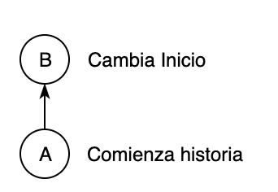
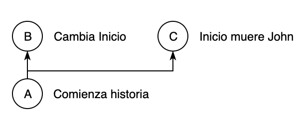
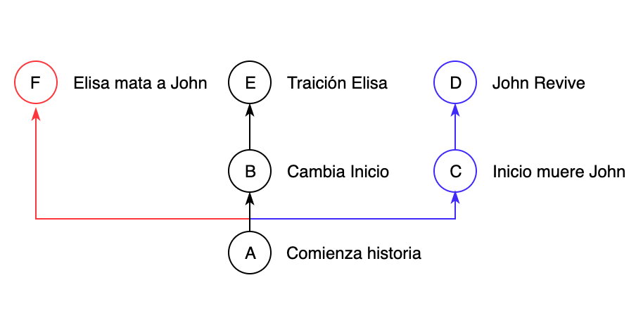
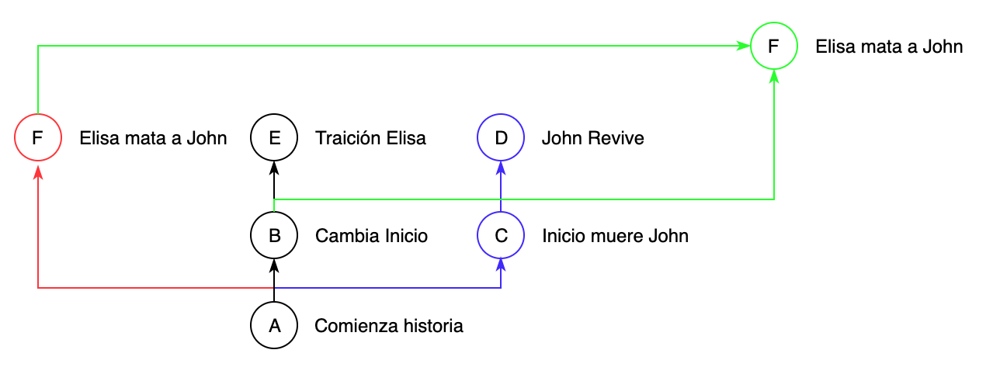
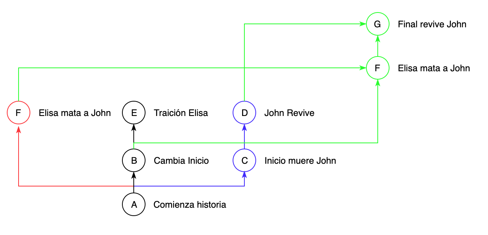

# Viajes en el tiempo con GIT

_by José Bonito_

Esta guía pretende adentrar al lector en el uso de git con un lenguaje mas "humano" sacando los tecnicismos y demostrando las posibilidades de dicha herramienta mas allá de la programación.

- [¿Que es GIT?](#que-es-git)
- [Un problema común](#un-problema-común)
- [Encendiendo la maquina del tiempo](#encendiendo-la-maquina-del-tiempo)
- [Punto de control `commit`](#punto-de-control-commit)
- [Resolviendo un problema común](#resolviendo-un-problema-común)
- [Creando otras lineas temporales `branch`](#creando-otras-lineas-temporales-branch)
- [Tomando una decisión `merge`](#tomando-una-decisión-merge)
- [La pesadilla de la manipulación temporal `conflict`](#la-pesadilla-de-la-manipulación-temporal-conflict)
- [La comunidad de viajeros en el tiempo](#la-comunidad-de-viajeros-en-el-tiempo)
- [Trabajando en equipo `remote`](#trabajando-en-equipo-remote)

### ¿Que es GIT?:

Imagina tener una maquina del tiempo donde puedas ver todos los cambios realizados en un conjunto de archivos de tu ordenador, poder ver cuando sucedieron, quien los realizó y mejor aun poderlos traer al presente. Esto es GIT, es una herramienta que nos permite no solo viajar en el tiempo si no también crear distintas _"lineas temporales"_.

### Un problema común

Supongamos que pretendemos escribir una historia y luego de llevar mas de media historia escrita se nos da la brillante idea de cambiar el comienzo de la historia, por suerte nos conocemos bien y sabemos que es una decisión de la que nos podemos arrepentir asi que creamos una copia del archivo, luego de terminar tenemos dos documentos con los nombres `historia.pdf` `historia_comienzo_alternativo.pdf`. Si seguimos este patrón, cada vez que esta situación se repita tendríamos documentos nuevos y peor aun si deseamos combinar algunos de estos documentos seria un total caos, además siempre tendríamos que predecir cuando es posible que nos "podamos arrepentir" para crear una copia del documento ya que de no ser asi se perdería.

Este caso lo vamos a resolver muy fácilmente con git pero antes vamos a poner en marcha nuestra maquina del tiempo.

### Encendiendo la maquina del tiempo

_Nota: No se explicará como instalar git pero te ahorro la búsqueda con el [link de la documentación oficial](https://git-scm.com/book/es/v1/Empezando-Instalando-Git)._

Una vez tienes git instalado en tu ordenador es necesario crear un proyecto de git en un directorio (una carpeta de tu ordenador), estos proyectos de git se llaman `repositorio` y asi es como nos referiremos a ellos de ahora en adelante.

El repositorio lleva el control de todos los cambios realizados dentro del directorio que fue creado, incluyendo todos los archivos y todos los sub-directorios.

[Comando para crear repositorio](COMMANDS.md#crear-el-repositorio-git-init-ruta)

Una vez creado un repositorio se creara un directorio llamado `.git` dentro de este directorio git guardara toda la lógica. Para efectos de esta guía no tocaremos el contenido de este directorio.

Ahora que ya tenemos un repositorio andando podemos empezar a [ver el estado de los ficheros](COMMANDS.md#ver-el-estado-de-los-ficheros-git-status) y guardar nuestros cambios en puntos de control.

### Punto de control `commit`

Es importante aclarar que nuestra maquina del tiempo llamada git solo nos permite viajar y manipular "puntos de control" previamente creados con git, estos "puntos de control" se llaman `commit` y asi es como nos referiremos a ellos de ahora en adelante (deja vu?).

Un `commit` no es mas que un punto de guardado del estado actual de nuestro proyecto, los `commit` también guardan entre otra serie de datos: creador, fecha, mensaje y un `delta`.

- El creador: Es la persona que generó dicho commit, se guarda email y nombre, esto es muy útil cuando en un mismo repositorio colaboran varias personas para saber que cambios realizó cada quien.

- Fecha: La fecha en la cual fue creado dicho commit.

- Mensaje: El mensaje nos permite dejar una breve descripción de los cambios o el motivo de ese commit, este mensaje nos facilitará ver en el historial todos los cambios realizados solo por los mensajes de cada commit.

- Delta: Es un identificador **único** auto-generado para cada commit, sirve para hacer referencia a un commit.

[Comando para crear un commit](COMMANDS.md#crear-un-commit-git-commit-m-mensaje-del-commit)

### Resolviendo un problema común

El caso de la historia [anteriormente planteado](#un-problema-común) se resolvería sencillamente creando `commit` luego de cada cambio significativo, de modo que no importaría si en algún momento nos arrepentimos ya que podemos volver en cualquier momento.

En la siguiente imagen se muestra el ejemplo donde en lugar de crear un documento nuevo con un inicio alternativo, simplemente se crea un commit `A` con el mensaje `Comienza historia` y luego un commit `B` con un mensaje `Cambia Inicio`.

Ahora en nuestro repositorio seguiríamos teniendo un mismo documento donde podemos [ver el historial de commits](COMMANDS.md#ver-historial-de-commits-git-log) y en cualquier momento podemos ver como era el comienzo original de la historia [viajando hacia el commit `A`](COMMANDS.md#viajando-entre-commits-git-checkout-nombre-branch-o-delta-commit).

### Creando otras lineas temporales `branch`

Hasta ahora solo hemos estado viajando en una misma linea temporal pero ¿que pasaría si volviéramos al commit `A` y queremos hacer un cambio diferente a los que están en el commit `B` donde por ejemplo muere un personaje?, pues al igual que en _[Back to the Future](https://es.wikipedia.org/wiki/Back_to_the_Future)_ no sobrescribimos los cambios en el commit `B` si no que podemos [crear una linea temporal](COMMANDS.md#crear-rama-git-checkout-b-nombre-rama-nueva) con cambios distintos, estas "lineas temporales" son llamados `branch`.

Ejemplo de nuestro historial de commit con dos `branch`.

### Tomando una decisión `merge`

¡Bien! luego de una buena jornada de escritura, gracias a nuestra maquina del tiempo logramos explayar todas nuestras ideas sin miedo alguno y ya tomamos una decisión sobre como queremos que termine nuestra historia, pero tenemos un problema, todas esas ideas están esparcidas en varios `branch` teniendo como resultado un historial de `commit` asi:

El resultado que deseamos obtener es una historia que tenga el inicio del commit `B`, seguido del commit `F` de la rama `roja` y como desenlace el commit `D` de la rama `azul`.

Por suerte git también te da la posibilidad de [unir ramas](COMMANDS.md#unir-ramas-git-merge-rama-a-unir), he incluso [traer cambios de un commit especifico](#traer-ficheros-de-otra-rama-o-commit-git-checkout-nombre-branch-o-delta-commit-fichero-o-directorio) sin importar su rama de origen, el termino para la acción unir ramas es `merge`.

Para realizar esto una de las tantas soluciones posible seria:

- Viajar al commit `B` y crear una rama `verde`.
- A esta rama `verde` le hacemos un `merge` de la rama `roja` obteniendo el siguiente resultado.
  
- Ahora hacemos un `merge` de la rama `azul`

Aquí haré una pausa para detallar un posible "problema" que debemos enfrentar.

### La pesadilla de la manipulación temporal `conflict`

Si realizamos un `merge` como el anterior nuestra maquina del tiempo nos dirá que hay un conflicto de merge, ya que git cuando hace un `merge` compara linea por linea entre dos `commit` y en este caso si nos traemos a nuestra rama `verde` los cambios de la rama `azul`, git no sabría con cual cambio quedarse entre los commit `B` y `C` ya que ambos modifican el inicio de la historia. El que git pueda detectar `merge conflict` realmente es una funcionalidad genial mas allá de tener un termino que da muy mala publicidad y ser muy "conflictivo".

En este punto del merge git nos pedirá que decidamos con cual parte del inicio de la historia nos queremos quedar, y si alguna otra parte del documento fue modificada en ambas ramas, también debemos elegir con cual quedarnos.
Una vez terminemos de decidir debemos crear un nuevo commit con nuestros cambios previamente seleccionados.

_Nota: Es importante entender que los conflictos de merge no son un problema, es una característica de git que nos permite decidir que cambios deseamos cuando hacemos merge de dos commit que modificaron la misma linea de un archivo._

### La comunidad de viajeros en el tiempo

Existe una comunidad llamada [github](https://github.com/) donde todos pueden mostrar sus repositorios y contribuir libremente, aunque esta guía esta pensada para todo público (programador o no programador), lamentablemente la gran mayoría de repositorios alojados en este sitio son proyectos de programación ya que la git (y el sitio de github) fueron creados pensados para el mundo de desarrollo digital, aun así esto no nos debe frenar a subir repositorios de todo tipo y encontrarnos con proyectos de todo tipo.

### Trabajando en equipo `remote`

En esta sección vamos a explicar como trabajar con proyectos remotos (que estén alojados en internet).

Ya tenemos finalizada nuestra historia y [agregamos nuestro repositorio remoto](COMMANDS.md#agregar-repositorio-remoto-git-remote-add-nombre-url-repo) con el nombre `origin` y [subimos nuestro `branch` `verde`](#subir-cambios-git-push-repo-rama).

Ahora [si vemos todos nuestros `branch`](COMMANDS.md#ver-listado-de-ramas-git-branch) podemos notar que poseemos dos veces el `branch` `verde` uno remoto llamado `origin/verde` y uno local llamado `verde`, el `origin/verde` representa el `branch` guardado en internet y el que se llama `verde` es el está en nuestra maquina.

Los `branch` remotos no se actualizan automáticamente asi que debemos hacerlo de [forma manual](COMMANDS.md#actualizar-branch-remoto-git-fetch-repo) y una vez realizado esta actualización debemos hacer un `merge` entre nuestro `branch` local y el remoto.
También es posible hacer una [actualización remota y local al mismo tiempo.](COMMANDS.md#actualizar-branch-remoto-y-local-git-pull-repo)
